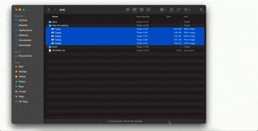

<p align="center">


</p>


(NOTE: works with images of the same size dimensions, and backend handles up to 5 files - this is modifiable in
index.js. You can test it using the images from the `files-for-testing` directory)

### Task

Create a web-app using React and Node.js. User uploads a series of images via dropzone, and receives a video output
which is a slideshow of the uploaded images with an interval of 500ms.

### Tech stack

Frontend:

- CRA
- React Hooks
- React-dropzone

Backend:

- Node.js
- Express
- ffmpeg

### Technical decisions

**Front-end** part was quite simple, but I did not have time to style the "loading" and "play video"
components to look the same as the Figma snapshots.

2 states are used: `isSelected`, `isUploaded`, initially set to `false`. When image-files are selected, `isSelected` is
updated to `true`, dropzone is replaced with the loading icon, and a post request is sent to a `/multiplefiles`
endpoint.

When this request is successful, `isUploaded` state is updated to `true`, and the generated video's play button is
displayed.

React-dropzone was configured to accept only JPEG and PNG files.

**Backend:**

One thing to be noted, `ffmpeg`'s Windows OS version was imported as standalone. However, the MacOS version needs to be
installed via the system for the app to run on MacOS. `index.js` checks if the OS where the app is running is `darwin` (
MacOS) or not and based on that determines which `ffmpeg` binaries to use.

2 endpoints were implemented:

#### /multiplefiles (POST)

1. Uploads selected images to server's `uploads/`
   directory using multer, images get renamed to
   `slideImg`+`current time milliseconds`+
   `original file extension`
2. Uses `videoshow` library (which uses `ffmpeg`) to generate a `video.mp4` video file from the uploaded images. **
   Number of allowed images is set to 5**, this value can be increased/decreased.

#### /video (GET)

Streams the `video.mp4` video file.

### Improvement suggestions

Given more time, it would be good to implement the following:

- Front-end design of "Loading" and "Play video"
  components to look the same as Figma
- If backend throws an error, it should be displayed in front-end.
- The app currently only accepts images which have the same size dimensions. Should implement logic to work with images
  of different size dimensions.
- Display a link to allow users to upload new series of images. (Currently, users need to refresh the page to upload new
  images).
- Dynamic naming of the generated video file, which is currently set to `video.mp4`.
- Implement the user authorisation feature to allow users to save/manage the video files they have generated.
- The app was tested on MacOS and Windows OS, but not on Linux OS.
- Unit tests
- Integration tests

### Install and run

1. Install packages for front and back-end:
    ```shell
    cd front
    npm i
    ```
    ```shell
    cd back
    npm i
    ```
   1.1. **Non-Windows OS:** Install ffmpeg    
   _e.g. MacOS:_
    ```shell
    brew install ffmpeg
    ```
2. Run front and back-end:
    ```shell
    cd front
    npm run start
    ```
    ```shell
    cd back
    node index.js
    ```
3. Access http://localhost:3000
